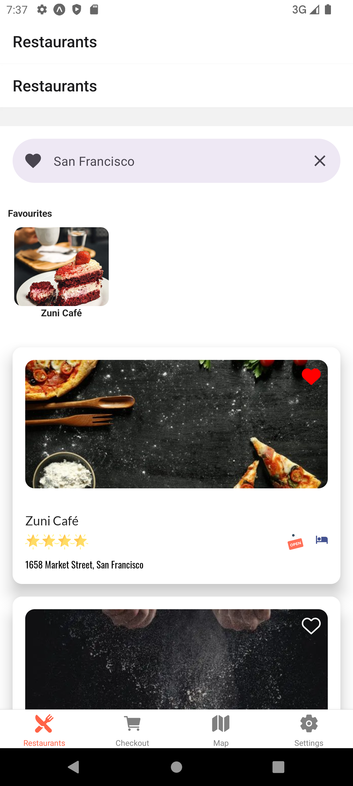
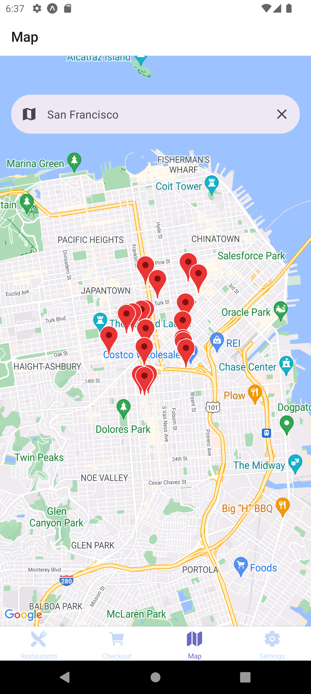
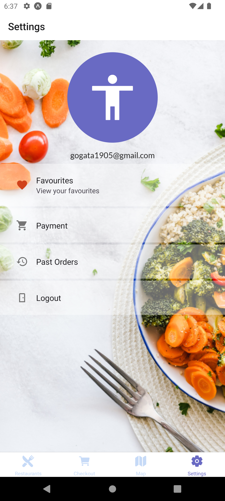
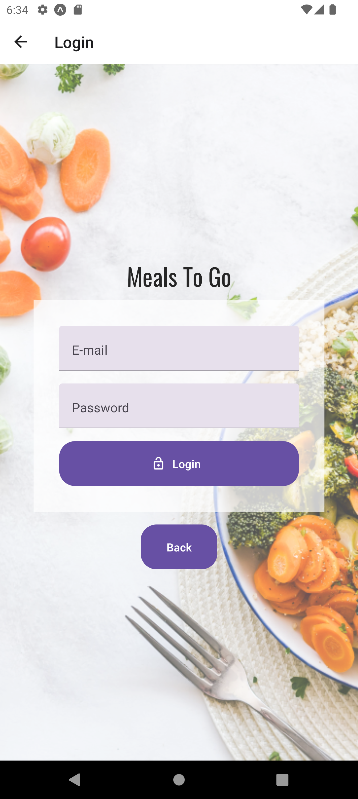
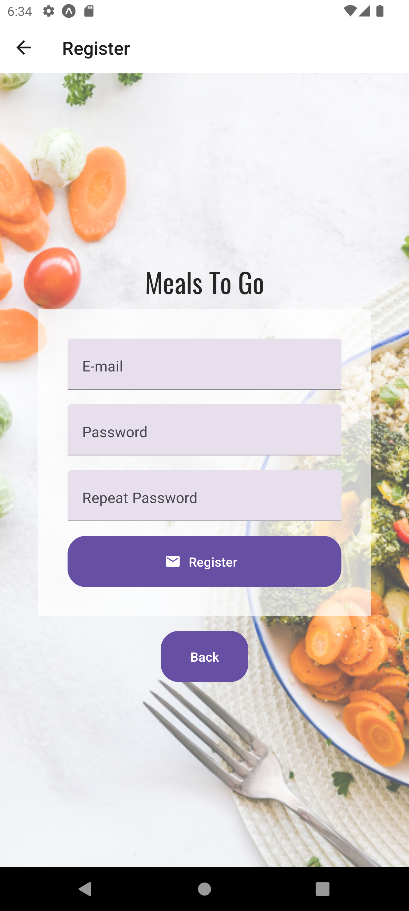
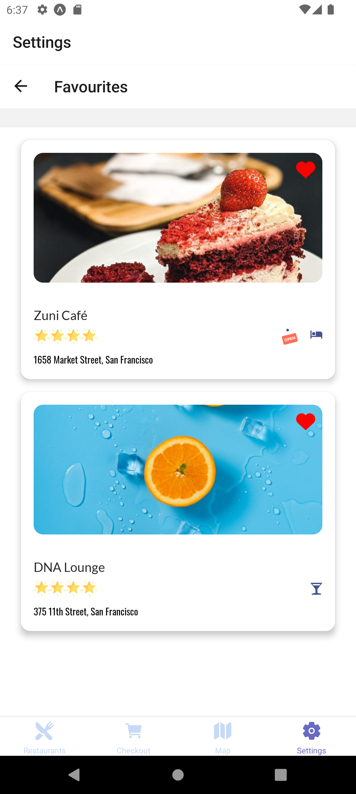
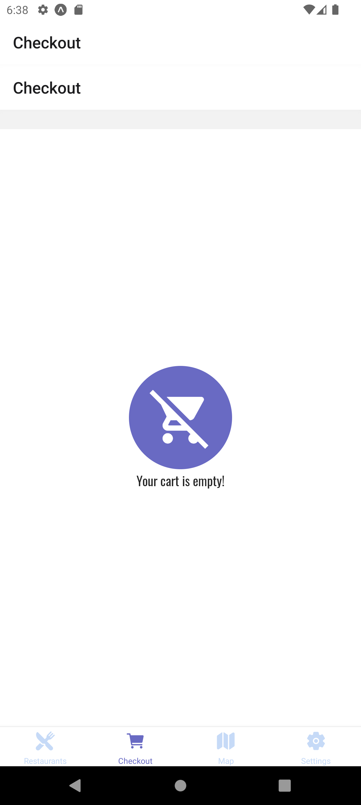

# MealsToGo

React Native Project 001

## Introduction

MealsToGo is application for finding restaurants and buying meals.

## Features

- Firebase
- Stripe Payment
- Google Maps
- Places API

## How to use?

- 0.Download the repository and extract it to folder
- 1.Go to functions folder
- 2.Make sure you have node 20 running or later (if later update the engine in package.json)
- 3.Run npm i
- 4.In Firebase console: Create a firebase project, make a web app,make Authentication Email/Password - https://console.firebase.google.com/u/0/
- 5.Copy firebaseConfig from firebase web app and paste it in App.js so it connects to the right firebase app
- 6.Login to firebase firebase login
- 7.Set the correct project name in firebase.json
- 8.Create a .runtimeconfig.json with
  {
  "stripe": {
  "key": "<empty>"
  },
  "google": {
  "key": "<empty>"
  }
  }
- 9.Run yarn serve in the firebase folder
- 10.Run the Expo app
- 11.Make sure env.js is set to mock mode real keys you want to test with (default to true on master).

